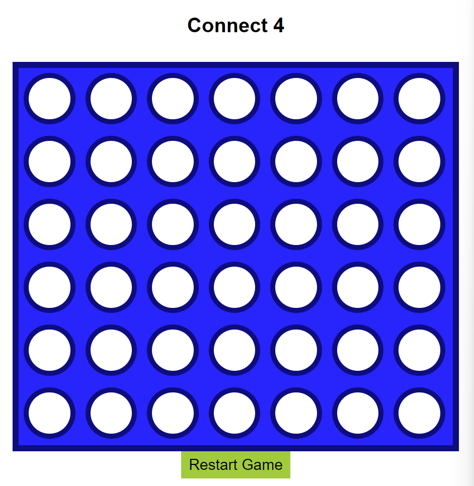

# Connect 4 Game

This is a simple implementation of the classic Connect 4 game built with Javascript, HTML, and CSS.  
2 players take turns dropping colored discs into a grid. With the utilization of a sliding door algorithm, the winner is determined via 4-in-a-row horizontally, vertically, or diagonally

## Features

- Two-player mode: Play against a friend locally  
- Responsive design: Play on desktop or laptop  
- Interactive gameplay: Click to drop discs into the grid  

## Usage
**To play the game**:
python -m http.server  
Go to **http://localhost:8000**  
Navigate to the HTML file and enjoy!!

### Technologies Used
- HTML: Markup language for structuring the game interface  
- CSS: Stylesheet language for styling the game board and discs
- Javascript: Programming language for implementing game logic and interactivity